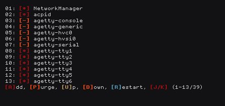
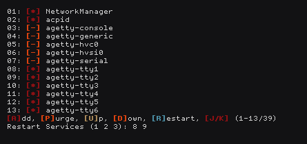

# BSV [0.1.0]
Void Linux Server manager in pure bash

### About
[BSV] is a interactive Void Linux Servers Manager menu in Pure bash

[BSV] allow you to ...

* Add Service(s)
* Purging Service(s)
* Up Service(s)
* Down Service(s)
* Restart Service(s)

[BSV] can automatically ...

* Check for active Services
* check for Services status

### Installation

* Installation Requires:

    * [Bash](https://www.gnu.org/software/bash/bash.html)
    * [Coreutils](https://www.gnu.org/software/coreutils/)

    `Probably they are already installed`

* Setup [BV]:

    ```bash
    git clone https://github.com/zakariaGatter/bsv.git
    git checkour tags/0.1.0
	mkdir -p ~/.local/bin
	cp bsv/bin/bsv ~/.local/bin
	chmod +x ~/.local/bin/bsv
    ```

### Usage

```
Bsv_0.1.0: Void Linux Servers Manager in Pure Bash
USAGE: bsv [OPTIONS]

OPTIONS:
    -h  Show this help dialog
    -v  Shwo Script Vesrion
```

# Preview




[BSV]:https://github.com/zakariagatter/bsv
